### Deploying cluster

Deploying a cluster on the Argonne-AI tenant is done using the resource->stack section in OCI

Configurations are provided using the terraform scripts at https://github.com/oracle-quickstart/oci-hpc . Download the master as .zip and upload under terraform configuration.

We basically define the login nodes, controller nodes, monitoring nodes and GPU compute nodes and use all standard configuration from the above oci-hpc terraform or ansible configuration.

Starting the stack in the multinode compartment

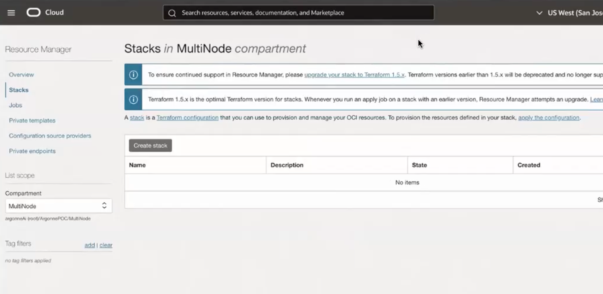

Adding the terraform scripts zip

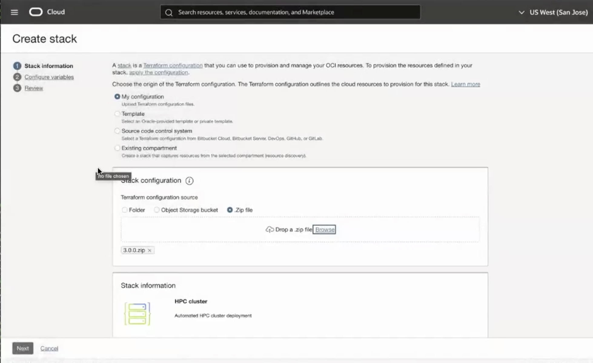

Adding the admins laptop ssh keys

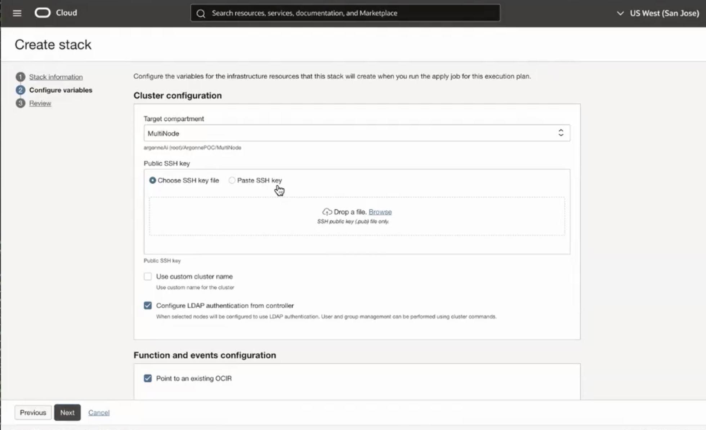

Configuring the login node

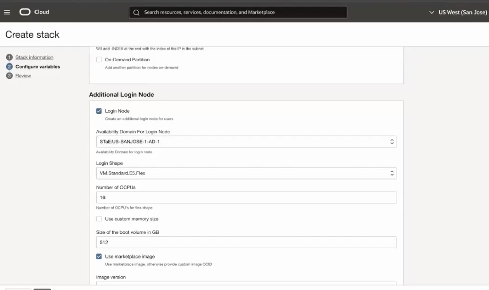

Configuring the monitoring node

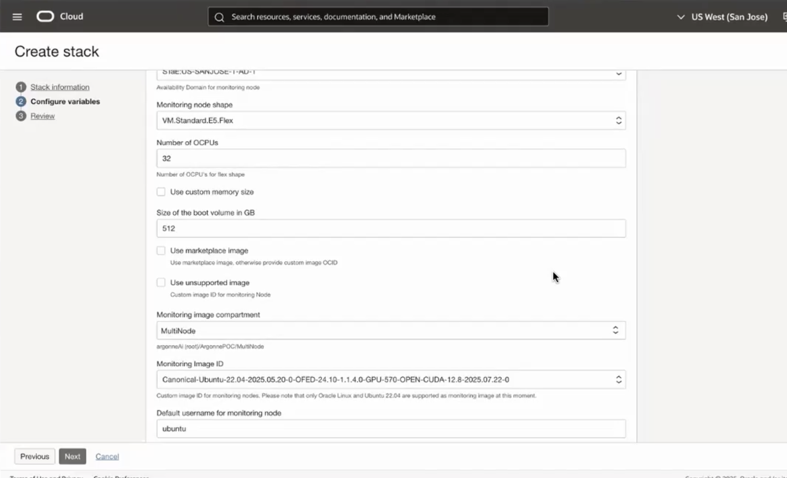

Configuring the filesystem NFS node

All nodes have a common shared file system /config, /home and /fss and varying sizes of local SSDs Note the common shared file system is NFS and not lustre

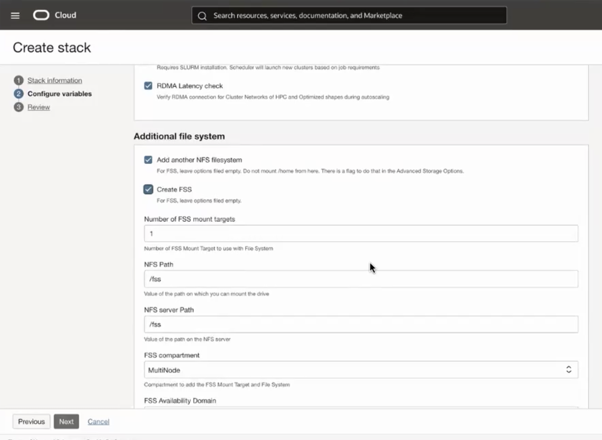

Configuring the local SSDs

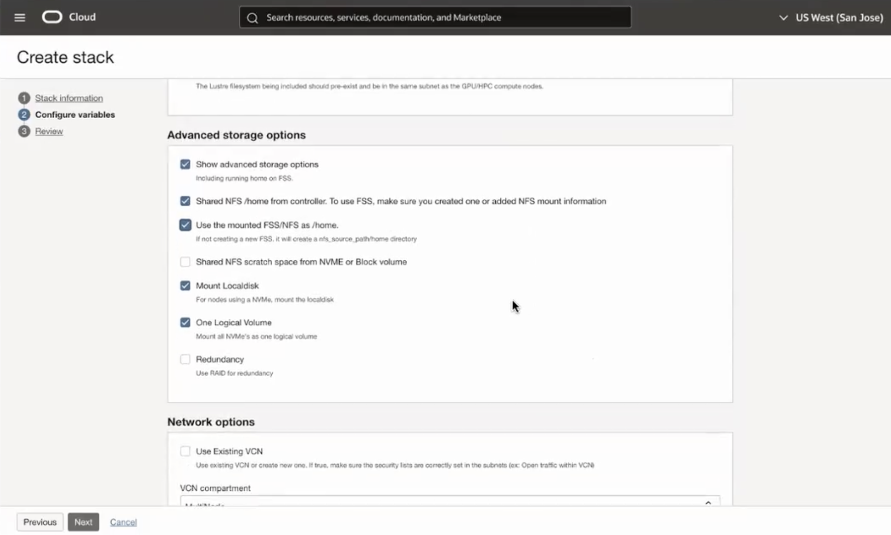

Configuring the network
login, controller in public subnet and compute in private subnet
ROCE V2

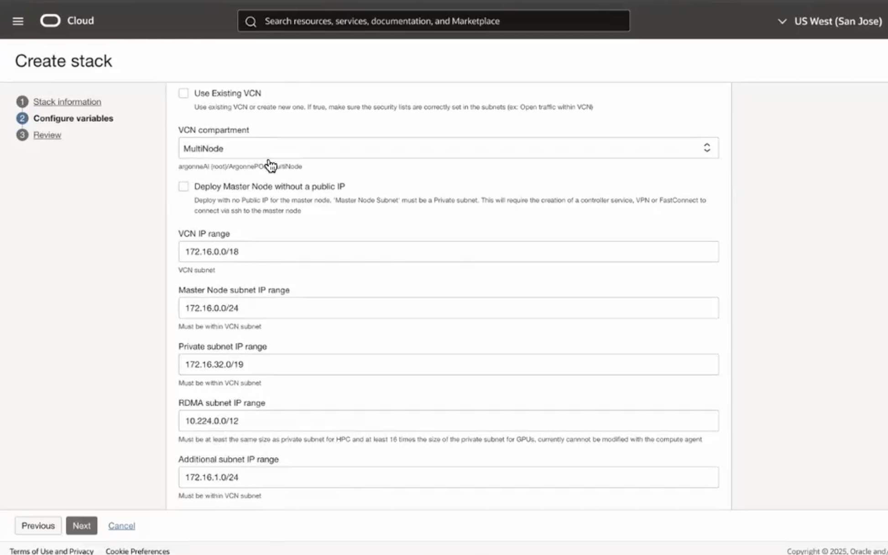

Configuring the slurm on the controller node

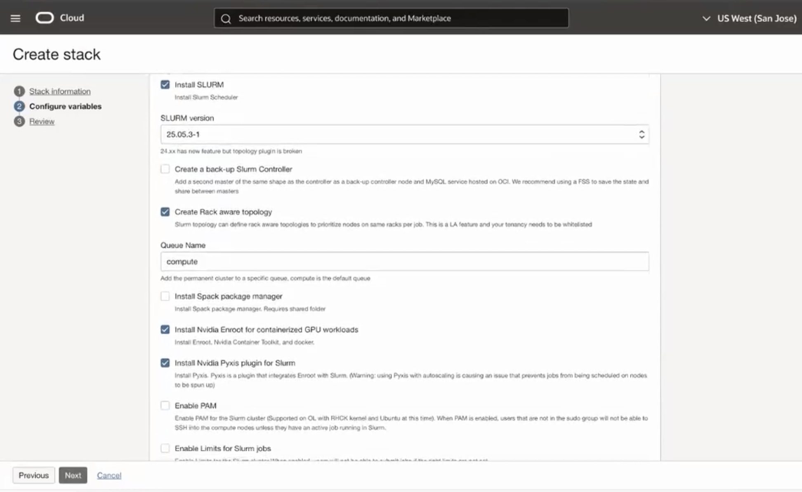

health check runs every 5mins and at the start of the job when enabled

Review, Run Deploy

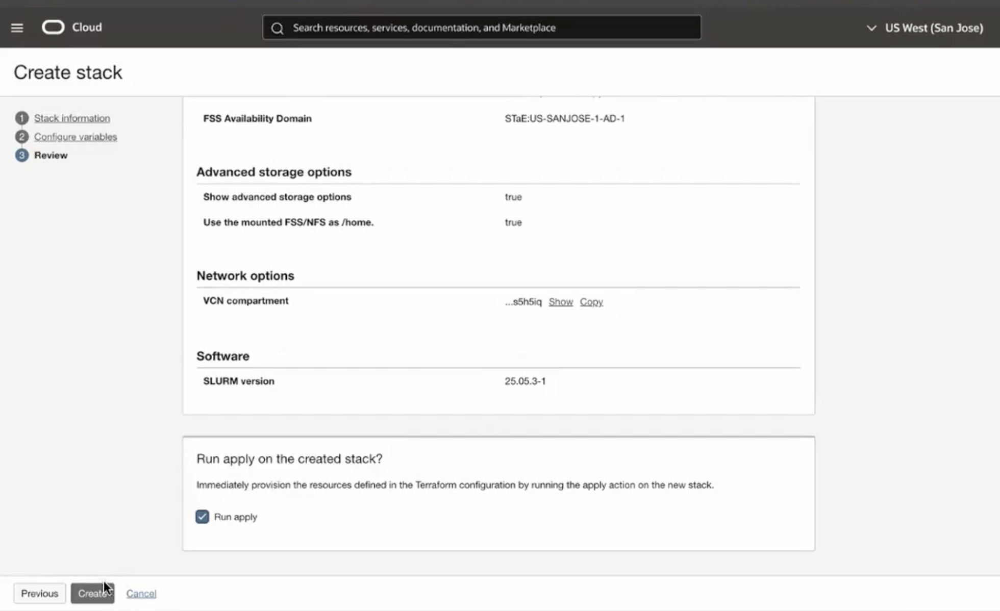

Verify the deployed NFS

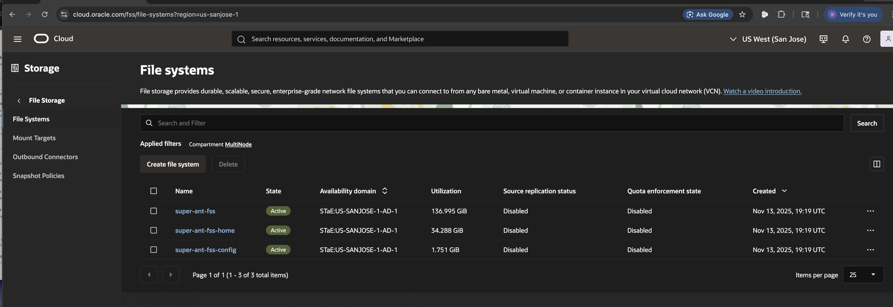

Verify the deployed networking at

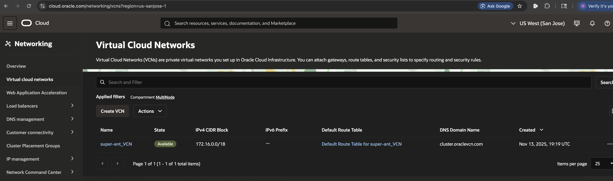

Verify the deployed instances

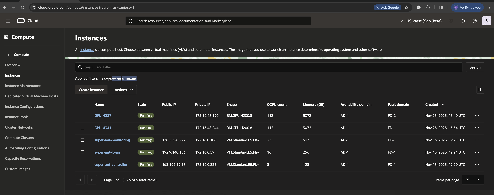

Copy the IP to login

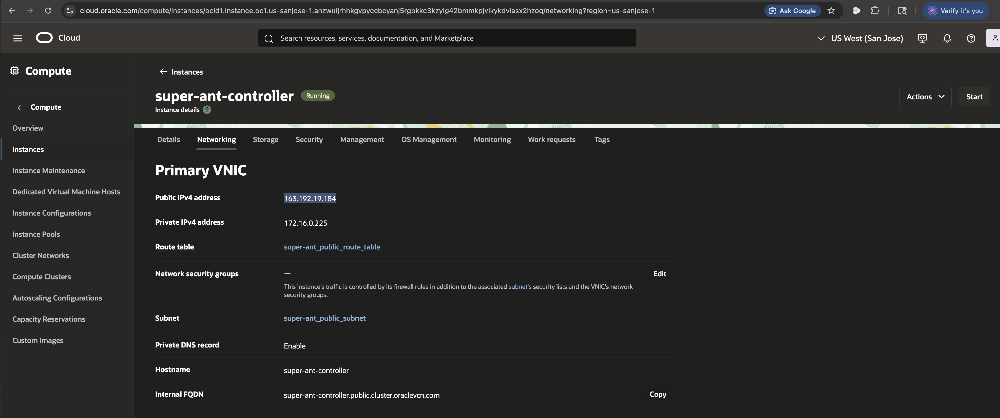

Verify the cuda version deployed

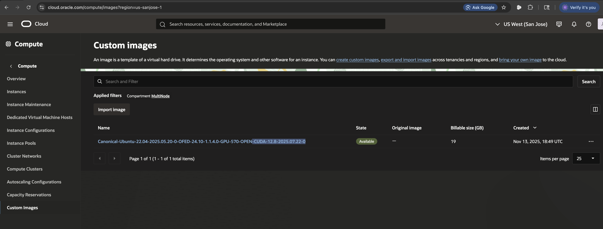

How to terminate the instances. can be rebooted using the mgmt commands on the controller as well.

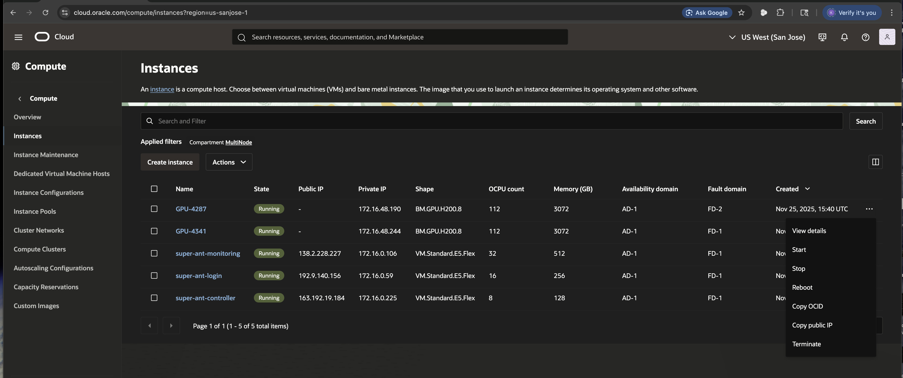

important mgmt commands

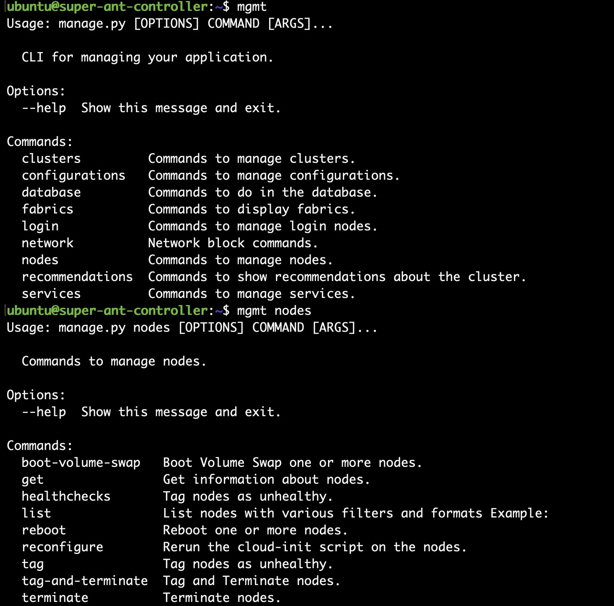

Get status on instances - More on monitoring later.

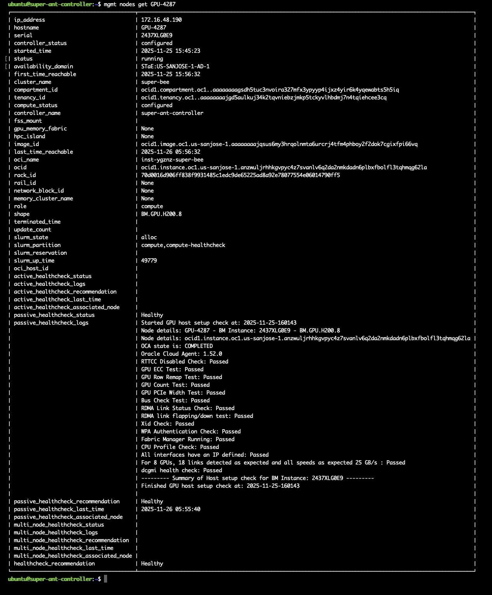

custom images can be built from https://github.com/oracle-quickstart/oci-hpc-images as well.
