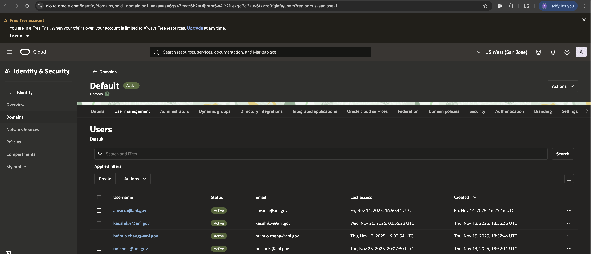
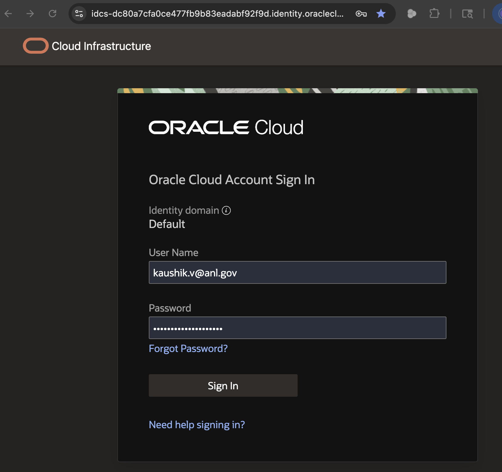
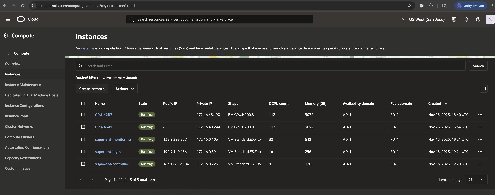

### Logging in to the web portal

Once the PI has added the user to Identity console in OCI, the user will recieve an email to activate their account. You also need to download the oracle mobile authenticator app and add the QR code during the account activation.



Once your account is activated, you can login to [https://cloud.oracle.com/identity/domains/my-profile?tenant=ArgonneAI&amp;domain=Default&amp;region=us-sanjose-1](https://cloud.oracle.com/identity/domains/my-profile?tenant=ArgonneAI&domain=Default&region=us-sanjose-1)



You can then verify the current instances under the Argonne-AI tenant.



Note, this is a preconfigured instances by the admin. We can deploy any cluster instance configuration using the terraform scripts and https://github.com/oracle-quickstart/oci-hpc . More on this later.

In this Argonne-AI test POC, we are provided with 1 frontend login node, 1 controller node, 2 Compute nodes and 1 monitoring node. Each compute node has 8 NVIDIA H200 and 8 RDMA enabled NICs. NVIDIA/Mellanox ConnectX-7 Ethernet NICs, and rdma7 is RoCE (RDMA over Converged Ethernet) on top of Ethernet. More on this under 2_oci_compute_infrastructure.md

Slurm and LDAP should be running in the controller node 

### Logging in to the instances through terminal

By default, we are provided with the username ubuntu. You need to provide your PI/admin currently your public keys to be added to the login node's .ssh authorized keys

From your laptop

```
(base) Kaushik:~ kvelusamy$     cat ~/.ssh/id_rsa.pub
ssh-rsa AAAAB3NzaC1yc2EAAAADAQABAAABgQDpZtvaDJepMDgbtxpVolTuSmyLbsAO9u4dngs4aMSRqb8tLNE2vVI3VbeKOmi57b78YaSPPTO2fFdr3DpYHx6M1UXSWI6pgwwyDigY2E+RrplNCm2c2uv3j75GZs5TFkNWSlE4qGgRIMK4Pg4yMx6K8qZ5s6BIWxMyPI79FwbvQdG+md/iDbKwjIe6OZNx5UyDa7LV7C/x8GyHyfp4yEBWSiNvzeoni2RzY9f2ucufukScV1hGSo4E9AJuJTNO2DPni3U1vNdQD5xXi3aYY74tFoZWi1gv/b1tcndy1L98AGHoVIiiTXPQTIZ+jucw4psMizio9lNV9KK7BAB06CDDNPTKVSCg+WMqn0+z8vPSRAjsJ03dOaCkStDyxgVDW9Dzf5131HNef5zgF8mtjL7/2uKtR84fo30FLgZsJb56H8xZiPGafXfkHYXIDErwSjQtvrcTgbW9wbuOsDlotZA0GGS+GYz4CNz9AUae0Y/6xpaLVQtto6E= kvelusamy@Kaushik
```

Once the PI/Admin has added your public keys to super-ant-login 192.9.140.156 or  super-ant-controller 163.192.19.184 /home/ubuntu/.ssh/authorized keys, then you should be able to login directly using ssh ubuntu@192.9.140.156

```
(base) Kaushik:~ kvelusamy$ ssh ubuntu@192.9.140.156
Enter passphrase for key '/Users/kvelusamy/.ssh/id_rsa': 
Welcome to Ubuntu 22.04.5 LTS (GNU/Linux 5.15.0-1074-oracle x86_64)
...
Last login: Wed Nov 26 03:07:29 2025 from 24.12.192.217
ubuntu@super-ant-login:~$
```

Note, you have to enter the passphrase that you created when you generated the ssh keys. Should be the same in case you have logged into any of our other systems. If you have entered empty passphrase, just press enter.

### Creating a new user under all instances

To create a new user, ssh to the controller node and use the cluster user command

```
ubuntu@super-ant-login:~$ ssh super-ant-controller
ubuntu@super-ant-controller:~$  cluster user add kaushik 
ubuntu@super-ant-controller:~$ 
```

This would create a username on all the nodes using their LDAP. Since /home is a shared file system, its reflected everywhere.

#### Setting some permissions and adding the new ssh keys for the new user

```
kaushik@super-ant-login:~$ chmod 750 "$HOME"          # or 700 if you want completely private # 1) Fix home dir perms
kaushik@super-ant-login:~$ find "$HOME" -type d ! -path "$HOME/.ssh*" -exec chmod 750 {} \; # 2) Fix directories (except .ssh) to 750
kaushik@super-ant-login:~$ find "$HOME" -type f ! -path "$HOME/.ssh*" -exec chmod 640 {} \; # 3) Fix files (except under .ssh) to 640
kaushik@super-ant-login:~$ # 4) Enforce strict SSH perms
kaushik@super-ant-login:~$ mkdir -p "$HOME/.ssh"
kaushik@super-ant-login:~$ chmod 700 "$HOME/.ssh"
kaushik@super-ant-login:~$ touch "$HOME/.ssh/authorized_keys"
kaushik@super-ant-login:~$ chmod 600 "$HOME/.ssh/authorized_keys"
kaushik@super-ant-login:~$ # 1) See kaushik's public key from his private key
kaushik@super-ant-login:~$ ssh-keygen -y -f ~/.ssh/id_ed25519 > /tmp/kaushik_id_ed25519.pub
kaushik@super-ant-login:~$ # 2) Compare with authorized_keys to see they differ
kaushik@super-ant-login:~$ diff /tmp/kaushik_id_ed25519.pub ~/.ssh/authorized_keys || echo "different"
kaushik@super-ant-login:~$ # 3) Append kaushik's key into authorized_keys
kaushik@super-ant-login:~$ ssh-keygen -y -f ~/.ssh/id_ed25519 >> ~/.ssh/authorized_keys
kaushik@super-ant-login:~$ # 4) Ensure perms are still strict
kaushik@super-ant-login:~$ chmod 700 ~/.ssh
kaushik@super-ant-login:~$ chmod 600 ~/.ssh/authorized_keys

kaushik@super-ant-login:~$ ssh GPU-4287
Welcome to Ubuntu 22.04.5 LTS (GNU/Linux 5.15.0-1074-oracle x86_64)
kaushik@GPU-4287:~$
```

* Set **umask 027** in **~/.bashrc** if you want new files/dirs to keep that style automatically.
* If you have exisiting user not created through cluster user in controller node, you need to delete it as root - following sudo userdel userold and rm -rf /home/userold and kill all procs sudo pkill -KILL -u userold and start again.

### Verifying the cluster and logging into GPU nodes

```
kaushik@super-ant-login:~$ mgmt nodes list
┏━━━━━━━━━━━━━━━━━━━━━━┳━━━━━━━━━━━━━━━━━━━━━━━━━━━━┳━━━━━━━━━┳━━━━━━━━━━━━━━━━┳━━━━━━━━━━━━━━┳━━━━━━━━━━━━━━━━━━━━━┳━━━━━━━━━━━━━━━━━━━━━━━━━━━━━━━━━━━━━━━━━━━━━━━━━━━━━━━━━━━━━━━━━━━━━━━━━━━━━━━━━━┳━━━━━━━━━━━━━━━┳━━━━━━━━━━━━━━━┳━━━━━━━━━━━━━━━━━━━━━┓
┃ hostname             ┃ healthcheck_recommendation ┃ status  ┃ compute_status ┃ cluster_name ┃ memory_cluster_name ┃ ocid                                                                             ┃ serial        ┃ ip_address    ┃ shape               ┃
┡━━━━━━━━━━━━━━━━━━━━━━╇━━━━━━━━━━━━━━━━━━━━━━━━━━━━╇━━━━━━━━━╇━━━━━━━━━━━━━━━━╇━━━━━━━━━━━━━━╇━━━━━━━━━━━━━━━━━━━━━╇━━━━━━━━━━━━━━━━━━━━━━━━━━━━━━━━━━━━━━━━━━━━━━━━━━━━━━━━━━━━━━━━━━━━━━━━━━━━━━━━━━╇━━━━━━━━━━━━━━━╇━━━━━━━━━━━━━━━╇━━━━━━━━━━━━━━━━━━━━━┩
│ GPU-4287             │ Healthy                    │ running │ configured     │ super-bee    │ None                │ ocid1.instance.oc1.us-sanjose-1.anzwuljrhhkgvpyc4z7svanlv6q2da2nmkdadn6plbxfbol… │ 2437XLG0E9    │ 172.16.48.190 │ BM.GPU.H200.8       │
│ super-ant-controller │                            │ running │ configured     │ super-ant    │ None                │ ocid1.instance.oc1.us-sanjose-1.anzwuljrhhkgvpyccbcyanj5rgbkkc3kzyig42bmmkpjvik… │ Not Specified │ 172.16.0.225  │ VM.Standard.E5.Flex │
│ super-ant-login      │                            │ running │ configured     │ super-ant    │ None                │ ocid1.instance.oc1.us-sanjose-1.anzwuljrhhkgvpycf4ojecjz3sy6rde232vi2iy2yvp65gh… │ Not Specified │ 172.16.0.59   │ VM.Standard.E5.Flex │
│ GPU-4341             │ Healthy                    │ running │ configured     │ super-bee    │ None                │ ocid1.instance.oc1.us-sanjose-1.anzwuljrhhkgvpych4zt3nl7nv4x65ni4zw4cgmp5jdo5o2… │ 2438XLG0D8    │ 172.16.48.244 │ BM.GPU.H200.8       │
│ super-ant-monitoring │                            │ running │ configured     │ super-ant    │ None                │ ocid1.instance.oc1.us-sanjose-1.anzwuljrhhkgvpycjxfifqh4y6nvk4x3pgunnevbontn76s… │ Not Specified │ 172.16.0.106  │ VM.Standard.E5.Flex │
└──────────────────────┴────────────────────────────┴─────────┴────────────────┴──────────────┴─────────────────────┴──────────────────────────────────────────────────────────────────────────────────┴───────────────┴───────────────┴─────────────────────┘
kaushik@super-ant-login:~$ 
kaushik@super-ant-login:~$ ssh GPU-4287
Welcome to Ubuntu 22.04.5 LTS (GNU/Linux 5.15.0-1074-oracle x86_64)
kaushik@GPU-4287:~$

kaushik@super-ant-login:~$ ssh GPU-4287
Welcome to Ubuntu 22.04.5 LTS (GNU/Linux 5.15.0-1074-oracle x86_64)
  System load:  0.98                Processes:             2401
  Usage of /:   10.1% of 247.92GB   Users logged in:       1
  Memory usage: 0%                  IPv4 address for eth0: 172.16.48.190
  Swap usage:   0%
 
Last login: Wed Nov 26 04:25:12 2025 from 172.16.0.59
kaushik@GPU-4287:~$ nvidia-smi
Wed Nov 26 04:35:32 2025   
+-----------------------------------------------------------------------------------------+
| NVIDIA-SMI 570.172.08             Driver Version: 570.172.08     CUDA Version: 12.8     |
|-----------------------------------------+------------------------+----------------------+
| GPU  Name                 Persistence-M | Bus-Id          Disp.A | Volatile Uncorr. ECC |
| Fan  Temp   Perf          Pwr:Usage/Cap |           Memory-Usage | GPU-Util  Compute M. |
|                                         |                        |               MIG M. |
|=========================================+========================+======================|
|   0  NVIDIA H200                    On  |   00000000:0F:00.0 Off |                    0 |
| N/A   32C    P0            120W /  700W |       0MiB / 143771MiB |      0%      Default |
|                                         |                        |             Disabled |
+-----------------------------------------+------------------------+----------------------+
|   1  NVIDIA H200                    On  |   00000000:2D:00.0 Off |                    0 |
| N/A   37C    P0            127W /  700W |       0MiB / 143771MiB |      0%      Default |
|                                         |                        |             Disabled |
+-----------------------------------------+------------------------+----------------------+
|   2  NVIDIA H200                    On  |   00000000:44:00.0 Off |                    0 |
| N/A   33C    P0            126W /  700W |       0MiB / 143771MiB |      0%      Default |
|                                         |                        |             Disabled |
+-----------------------------------------+------------------------+----------------------+
|   3  NVIDIA H200                    On  |   00000000:5B:00.0 Off |                    0 |
| N/A   37C    P0            122W /  700W |       0MiB / 143771MiB |      0%      Default |
|                                         |                        |             Disabled |
+-----------------------------------------+------------------------+----------------------+
|   4  NVIDIA H200                    On  |   00000000:89:00.0 Off |                    0 |
| N/A   32C    P0            124W /  700W |       0MiB / 143771MiB |      0%      Default |
|                                         |                        |             Disabled |
+-----------------------------------------+------------------------+----------------------+
|   5  NVIDIA H200                    On  |   00000000:A8:00.0 Off |                    0 |
| N/A   37C    P0            127W /  700W |       0MiB / 143771MiB |      0%      Default |
|                                         |                        |             Disabled |
+-----------------------------------------+------------------------+----------------------+
|   6  NVIDIA H200                    On  |   00000000:C0:00.0 Off |                    0 |
| N/A   37C    P0            127W /  700W |       0MiB / 143771MiB |      0%      Default |
|                                         |                        |             Disabled |
+-----------------------------------------+------------------------+----------------------+
|   7  NVIDIA H200                    On  |   00000000:D8:00.0 Off |                    0 |
| N/A   32C    P0            122W /  700W |       0MiB / 143771MiB |      0%      Default |
|                                         |                        |             Disabled |
+-----------------------------------------+------------------------+----------------------+
                                                                                   
+-----------------------------------------------------------------------------------------+
| Processes:                                                                              |
|  GPU   GI   CI              PID   Type   Process name                        GPU Memory |
|        ID   ID                                                               Usage      |
|=========================================================================================|
|  No running processes found                                                             |
+-----------------------------------------------------------------------------------------+
kaushik@GPU-4287:~$ 

```
