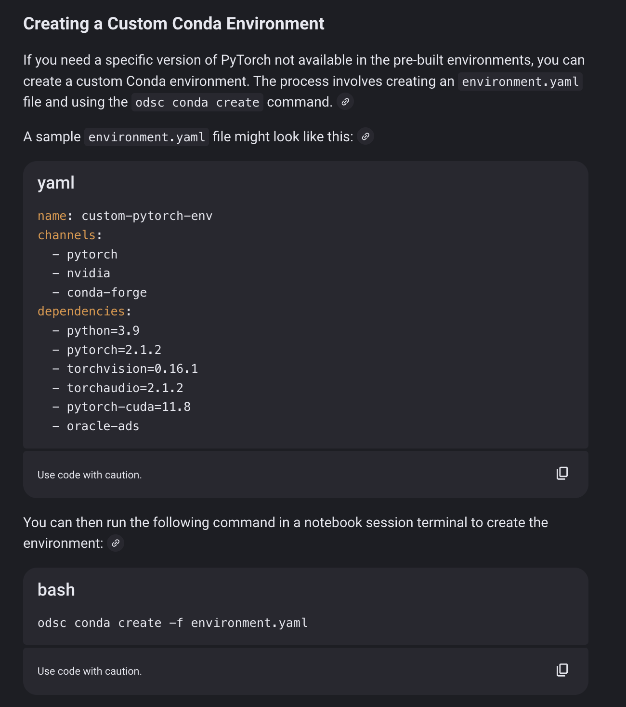

# creating a shared directory which can be accessible across all nodes

```
root@super-ant-login:~# mkdir -p /fss/kaushik
root@super-ant-login:~# sudo chown kaushik:privilege /fss/kaushik
root@super-ant-login:~# sudo chmod 755 /fss/kaushik 
```


1. Install Miniconda under /fss/kaushik
```
# As kaushik
mkdir -p /fss/kaushik/envs

wget -q -P /tmp https://repo.anaconda.com/miniconda/Miniconda3-latest-Linux-x86_64.sh

bash /tmp/Miniconda3-latest-Linux-x86_64.sh \
  -b \
  -p /fss/kaushik/miniconda3

rm /tmp/Miniconda3-latest-Linux-x86_64.sh

# Load conda into your shell
source /fss/kaushik/miniconda3/etc/profile.d/conda.sh

# (Optional but nice) tell conda to put envs under /fss/kaushik/envs by default
conda config --add envs_dirs /fss/kaushik/envs
```

2. Oracle ADS env under /fss/kaushik/envs/oracle-ads


Instead of a named env in $HOME, create a prefix env:

```
# Make sure conda is loaded
source /fss/kaushik/miniconda3/etc/profile.d/conda.sh

# Create env at /fss/kaushik/envs/oracle-ads
conda create -y -p /fss/kaushik/envs/oracle-ads python==3.10

# Activate by path
conda activate /fss/kaushik/envs/oracle-ads

# Install ADS with opctl extras
python3 -m pip install "oracle-ads[opctl]"

# Sanity check
ads opctl -h
```

You can later activate it from any node (with /fss mounted):

```
source /fss/kaushik/miniconda3/etc/profile.d/conda.sh
conda activate /fss/kaushik/envs/oracle-ads
```

3. PyTorch CUDA 12.1 env under /fss/kaushik/envs/pytorch_cuda121

```
# Load conda
source /fss/kaushik/miniconda3/etc/profile.d/conda.sh

# Create env in /fss
conda create -y -p /fss/kaushik/envs/pytorch_cuda121 python=3.10

# Activate
conda activate /fss/kaushik/envs/pytorch_cuda121

# Install PyTorch + CUDA 12.1
conda install -y \
  pytorch torchvision torchaudio pytorch-cuda=12.1 \
  -c pytorch -c nvidia

```

Later, from any node:

```
source /fss/kaushik/miniconda3/etc/profile.d/conda.sh
conda activate /fss/kaushik/envs/pytorch_cuda121
conda info --envs
ls -d /fss/kaushik/envs/*

```
 

# ODSC - For future exploration

oci provides a much cleaner way for managing packages through odsc. It is a User-Facing Tool. The users directly interact with odsc commands (e.g., odsc conda publish, odsc job run, odsc model deploy). odsc wraps standard Conda functionality but adds critical OCI-specific logic for deployment accross instances and manages the environment creation/copying to your OCI tenancy. It acts as a configuration tool that tells the OCI platform which environment to use when it automatically provisions a new compute node to run your code at scale.
It could go under https://github.com/oracle-quickstart/oci-hpc/tree/master/playbooks/roles so its available on all nodes.




For future reference 


https://docs.oracle.com/en-us/iaas/Content/data-science/using/conda_understand_environments.htm ODSC
https://accelerated-data-science.readthedocs.io/en/latest/
https://docs.oracle.com/en-us/iaas/tools/oci-cli/3.71.0/oci_cli_docs/cmdref/opctl.html
publishing modules in OCI Object Storage for team reuse.
https://github.com/oracle-samples/oci-data-science-ai-samples

