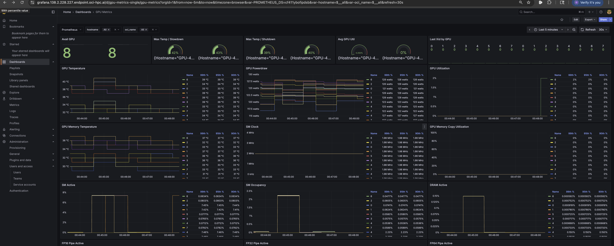
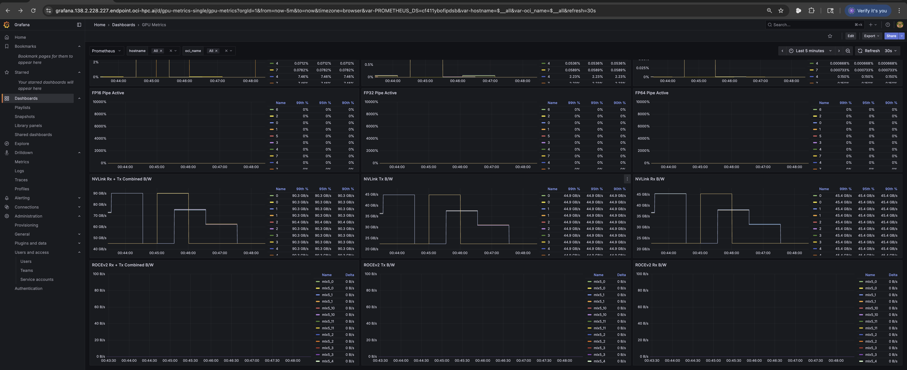
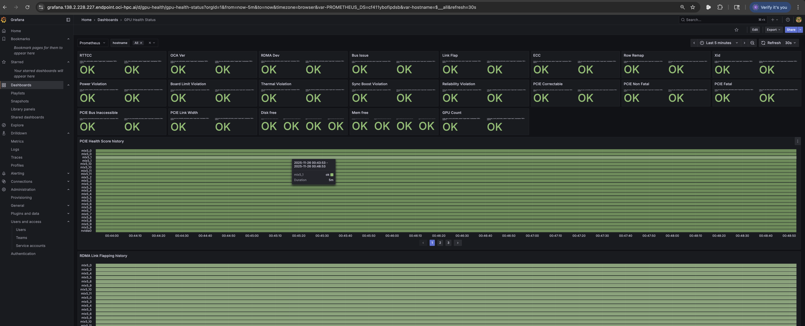
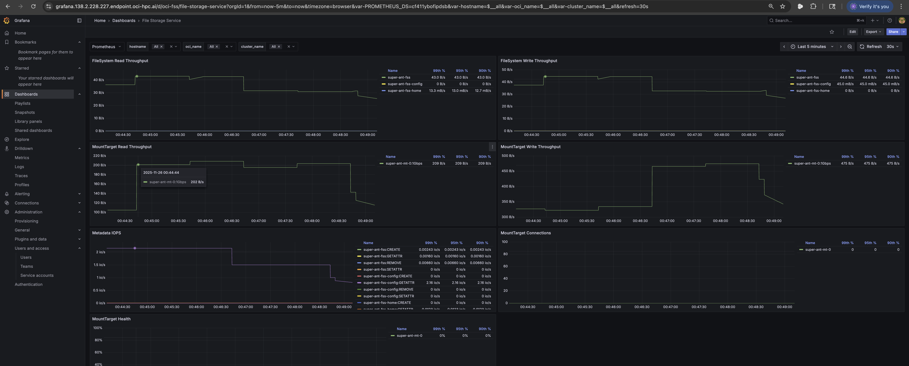
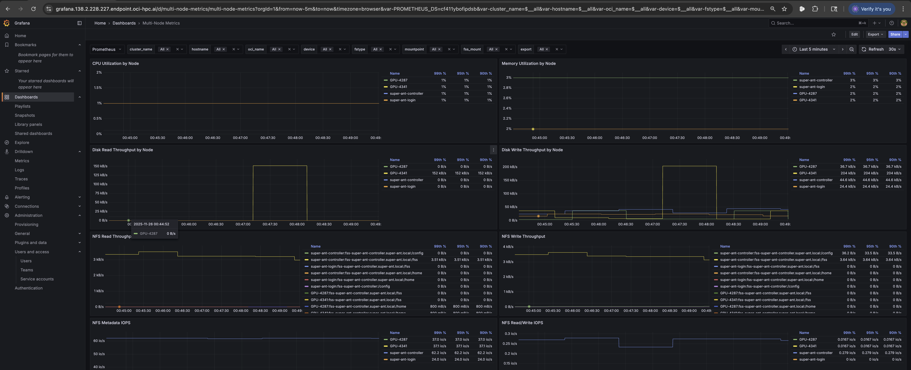
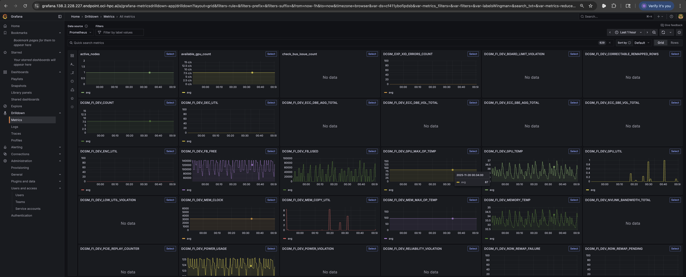
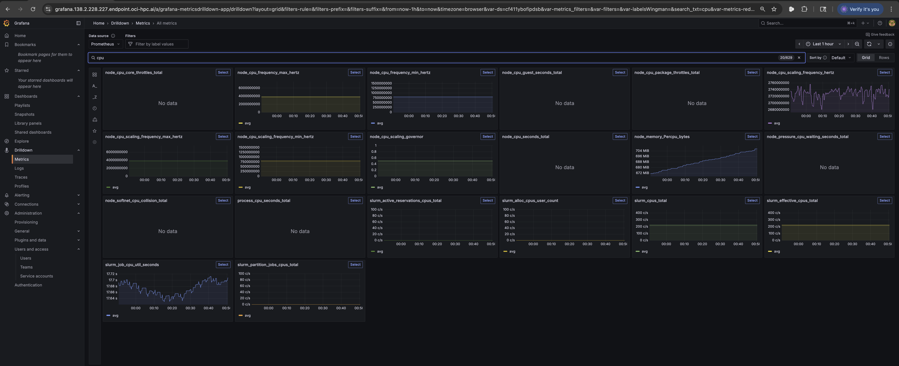
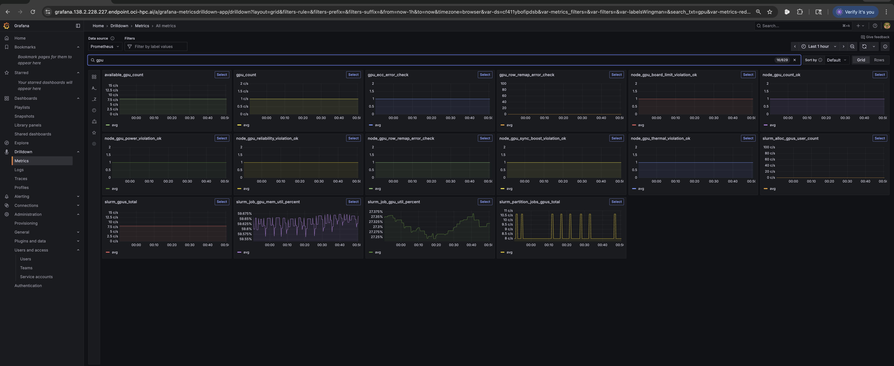
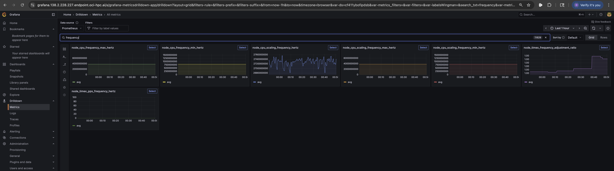
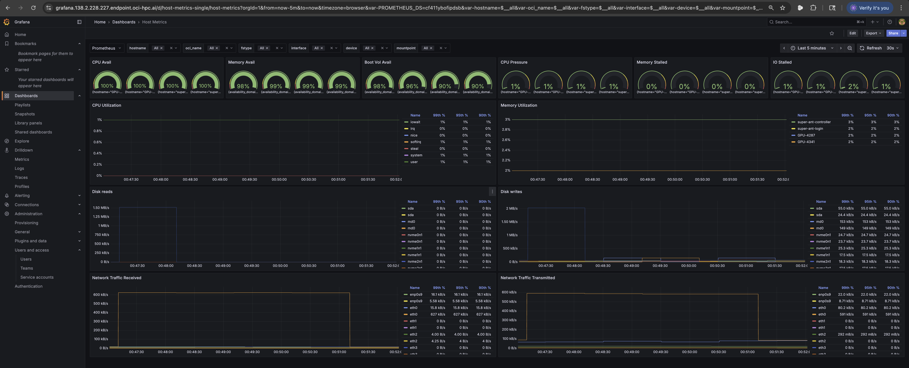

## Monitoring 

The monitoring node has promethus and graphana running on **super-ant-monitoring** ** **172.16.0.106** **

[https://grafana.138.2.228.227.endpoint.oci-hpc.ai](https://grafana.138.2.228.227.endpoint.oci-hpc.ai/)

username :admin

password :WQ32gthVAWb-t9jg

GPU Metrics 1

GPU Metrics 2

GPU status

File Storage Status

Multinode metrics

All Metrics

CPU metrics

GPU Metrics 3

Frequency Metrics

Host Metrics

Billing 1

Billing 2

